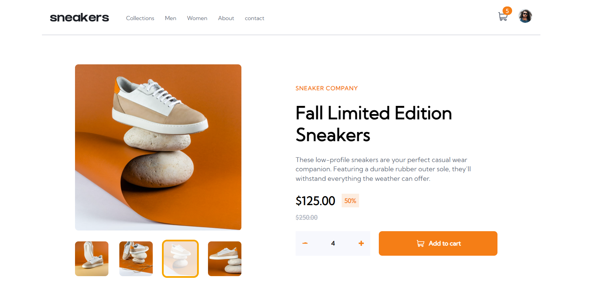
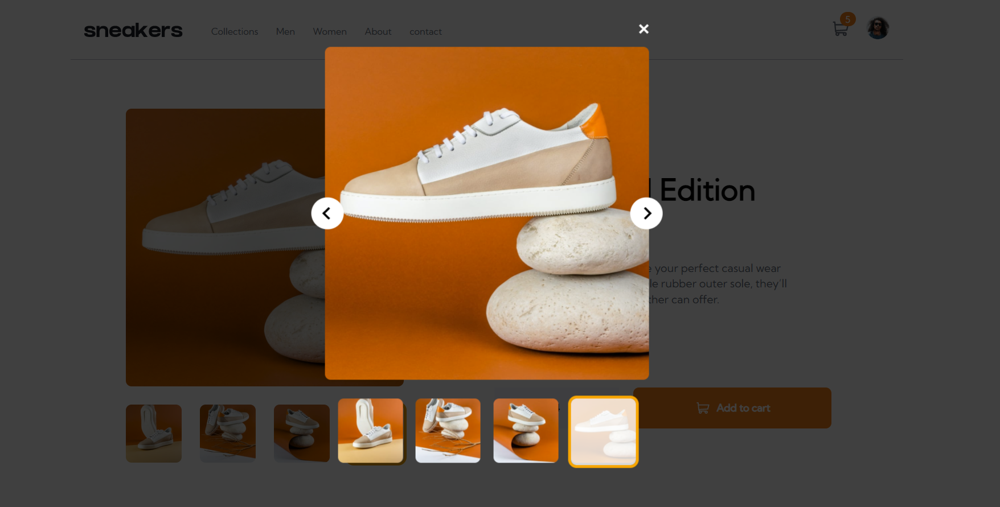
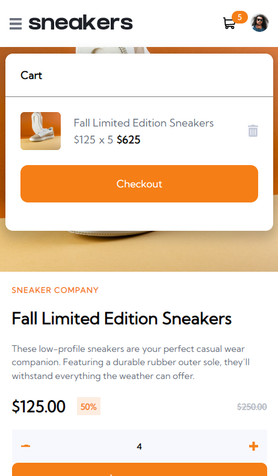

# Frontend Mentor - E-commerce product page solution

This is a solution to the [E-commerce product page challenge on Frontend Mentor](https://www.frontendmentor.io/challenges/ecommerce-product-page-UPsZ9MJp6). Frontend Mentor challenges helps improve coding skills by building realistic projects.

## Table of contents

- [Overview](#overview)
  - [The challenge](#the-challenge)
  - [Screenshot](#screenshot)
  - [Links](#links)
- [My process](#my-process)
  - [Built with](#built-with)
  - [What I learned](#what-i-learned)
  - [Continued development](#continued-development)
- [Author](#author)


## Overview

### The challenge

Users should be able to:

- View the optimal layout for the site depending on their device's screen size
- See hover states for all interactive elements on the page
- Open a lightbox gallery by clicking on the large product image
- Switch the large product image by clicking on the small thumbnail images
- Add items to the cart
- View the cart and remove items from it

### Screenshots

Here are screenshots of the project in different states:


Here is the main page with item added to cart.

<br>


Here is the modal gallery, which is activated by clicking the main image.

<br>


This is the mobile view of when a item gets added to the cart.

### Links

(LINKS TO BE ADDED)
- Solution URL: [Add solution URL here](https://your-solution-url.com)
- Live Site URL: [Add live site URL here](https://your-live-site-url.com)

## My process

### Built with

- Semantic HTML5 markup
- Flexbox
- [SASS](https://sass-lang.com)
- SASS Mixins & Variables
- Mobile-first workflow
- [React](https://reactjs.org) - JS library
- [ReduxToolkit](https://redux-toolkit.js.org) - A Library used for state management
- [ReactRedux](https://react-redux.js.org) Redux specific to react.

### What I learned

One of the main areas I improved on in this project was **preplanning** the css & the functionality of certain features. For example, the cart UI & functionality I wanted to make sure that these would work in the context of a real ecommerce site, and if needed to, multiple items could be added to this cart and it would still be fully functional. I done this by making the item into a object and placing the object onto an array, so now we can add multiple items to this array which would render them into the cart dynamically. I added overflow scroll to the cart UI, so when more items are added, the cart Ui doesn't start covering the whole screen. Which i think would have been a poor user experience.

I also learned how to create a gallery, with multiple thumbnails being able to select the main image. While also creating active styles and adding them to the thumbnail to display which image was currently active. I was able to do this by having the array of images and having a active number in the state connected to the index of the current image in the array.


### The CartItem component
```js
export const CartItem = () => {
  const [isCartEmpty, setIsCartEmpty] = useState(true)
  const {cartItems} = useSelector(store => store.overall)
  const dispatch = useDispatch()
  //
  const handleDeleteItem = (id) => {
    const newCartItems = cartItems.filter(item => item.id !== id)
    dispatch(deleteItemFromCart(newCartItems))
  }
  //
  useEffect(() => {
    if (cartItems.length <= 0) setIsCartEmpty(true)
    if(cartItems.length > 0) setIsCartEmpty(false)
  }, [cartItems.length])
  //
  return (
    <div
      className={
      isCartEmpty ? "cart-content cart-center-empty" : "cart-content"}>
      {isCartEmpty ? (
        <p className="cart-empty">Your cart is empty.</p>
      ) : ( cartItems.map((item) => {
          const { id, name, price, amountOfItems, totalPrice, thumb } = item;
      return(<div key={id} className="cart-item">
    <div className="cart-item-overall">
        
      <div className="cart-item-info">
        <p className="cart-item__title">{name}</p>
        <div className="cart-item-prices">
          <p className="cart-item__price">${price.toFixed()}</p>
          <p className="cart-item__amount"> x {amountOfItems}</p>
          <p className="cart-item__total">${totalPrice.toFixed()}</p>
        </div>
      </div>
      <Delete className="cart-item-delete"
      onClick={() => {
        handleDeleteItem(id)}}/>
    </div>
  </div>)}))}
  {isCartEmpty || <button className="cart__btn">Checkout</button>}
</div>
  )
}
```

### Continued development

This project definitely helped me practice to learn what is needed in order to build a product page. I will be using what I've learned here in order to build more cleaner and steamlined product pages in future projects. Especially in the context of a real store website, where we can reuse a product page component in order to display multiple different products.

## Author

- Website - [David Henery](https://www.djhwebdevelopment.com)
- Frontend Mentor - [@David-Henery4](https://www.frontendmentor.io/profile/David-Henery4)
- LinkedIn - [David Henery](https://www.linkedin.com/in/david-henery-725458241)

